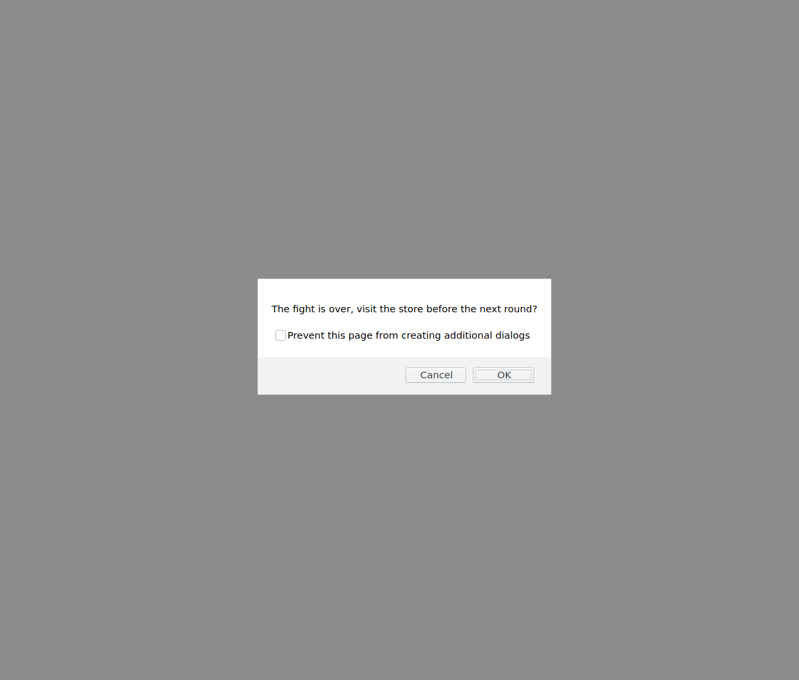

#### Robot Gladiators

Robot fighting/ adventure game written in pure JS.

#### Issues
- [x] [Initial game functionality - MVP](https://github.com/MBrassey/robot-gladiators/issues/1)
- [x] [Add shop functionality](https://github.com/MBrassey/robot-gladiators/issues/2)
- [x] [Add randomness to health and damage values](https://github.com/MBrassey/robot-gladiators/issues/3)
- [x] [Restructure data with JS objects](https://github.com/MBrassey/robot-gladiators/issues/4)
- [x] [Player Name Prompt Error Handling](https://github.com/MBrassey/robot-gladiators/issues/5)
- [x] [Fight/Skip prompt response handling](https://github.com/MBrassey/robot-gladiators/issues/6)
- [x] [Integer input for prompt in shop() function](https://github.com/MBrassey/robot-gladiators/issues/7)
- [x] [Randomize order in the fight() function](https://github.com/MBrassey/robot-gladiators/issues/8)
- [x] [Save high score](https://github.com/MBrassey/robot-gladiators/issues/9)
- [x] [Rewards system + fix any last issues](https://github.com/MBrassey/robot-gladiators/issues/10)

<h6>
:cyclone: Click the image(s) below to view the live <a id="Screenshots" href="https://MBrassey.github.io/robot-gladiators/">webapplication</a>
</h6>

[
](https://MBrassey.github.io/robot-gladiators/)

#### Questions
Contact me at [matt@brassey.io](mailto:matt@brassey.io) with any questions or comments.

#### License
`Robot-Gladiators` is published under the __CC0_1.0_Universal__ license.

> The Creative Commons CC0 Public Domain Dedication waives copyright interest in a work you've created and dedicates it to the world-wide public domain. Use CC0 to opt out of copyright entirely and ensure your work has the widest reach. As with the Unlicense and typical software licenses, CC0 disclaims warranties. CC0 is very similar to the Unlicense.