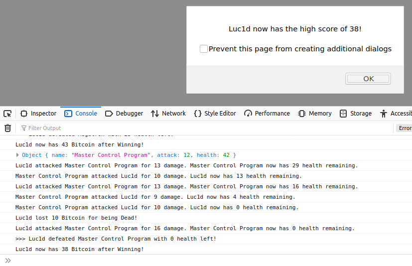

# Robot Gladiators

> Robot fighting/ adventure game written in pure JS.

- [x] [Initial game functionality - MVP](https://github.com/MBrassey/robot-gladiators/issues/1)
- [x] [Add shop functionality](https://github.com/MBrassey/robot-gladiators/issues/2)
- [x] [Add randomness to health and damage values](https://github.com/MBrassey/robot-gladiators/issues/3)
- [x] [Restructure data with JS objects](https://github.com/MBrassey/robot-gladiators/issues/4)
- [x] [Player Name Prompt Error Handling](https://github.com/MBrassey/robot-gladiators/issues/5)
- [x] [Fight/Skip prompt response handling](https://github.com/MBrassey/robot-gladiators/issues/6)
- [x] [Integer input for prompt in shop() function](https://github.com/MBrassey/robot-gladiators/issues/7)
- [x] [Randomize order in the fight() function](https://github.com/MBrassey/robot-gladiators/issues/8)
- [x] [Save high score](https://github.com/MBrassey/robot-gladiators/issues/9)
- [x] [Rewards system + fix any last issues](https://github.com/MBrassey/robot-gladiators/issues/10)

<h6>
[ Click the below image to view the <a href="https://MBrassey.github.io/robot-gladiators/">webapplication</a> ]
</h6>

[
](https://MBrassey.github.io/robot-gladiators/)